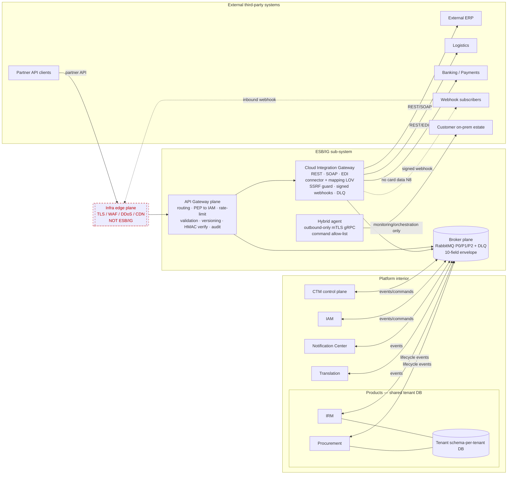

# ESB/IG Sub-System — Developed Design & Integration Chart

> The **chart** the driver asked for: every API and integration, in and out, and the plane of ESB/IG
> it traverses — plus the two-and-a-half carve-outs that deliberately do **not**. Grounded in the
> platform docs, the SEC-EVT/APP/NET control catalogue, and three best-practice research passes
> ([T07](tickets/07-research-gateway-esb-cig-responsibilities.md),
> [T08](tickets/08-research-integration-styles-shared-db.md),
> [T09](tickets/09-research-egress-webhook-security.md)). Sits alongside the wayfinder
> [map](map.md) and [plan](plan.md); refer to decisions by ticket name.

> **Decision status.** ✅ **All six decisions (T01–T06) are confirmed & closed by the driver on
> 2026-07-24**, together with the research tickets (T07–T09). The flagged decision — the shared-DB
> inversion in §3, and the assumption that IRM/Procurement share the tenant DB — was **explicitly
> ratified**: ESB/IG-by-default; data-plane only for the co-located case; behavioral events always via
> ESB/IG.

---

## 1. What ESB/IG is, and the mandate

ESB/IG is the platform-wide **L4 Enterprise Service Bus / Integration Gateway** — the **single,
mandatory, governed mediation point** for traffic that crosses a trust or system boundary. The
mandate (**SEC-EVT-01**): **no direct application-to-external path, and no unmediated cross-boundary
API path.** It serves **all** sub-systems app-agnostically (`application_id` on every table) and
connects to consumers by **events/commands, not business calls** (N2/N3). It is built **greenfield**
in `D:\PMO\Phase 1\ESB-IG\`, starting from the **RabbitMQ broker seed** graduated out of CTM.

Best practice cleanly separates three concerns, and ESB/IG implements all three as distinct planes
(gateway = boundary; ESB = mediation/transport; iPaaS = outbound connectors) —
[T07 responsibility matrix](tickets/07-research-gateway-esb-cig-responsibilities.md).

---

## 2. The three planes (+ the carve-outs)

| Plane | Axis | Sync? | Responsibility |
|---|---|---|---|
| **API Gateway plane** | North–south (boundary) | Inline, synchronous | The single governed door for **inbound** boundary-crossing API calls and inbound webhooks: routing, TLS (app-tier), identity **hand-off to IAM** (PEP), rate-limit, validation, version negotiation, HMAC verify, audit. |
| **Cloud Integration Gateway (CIG)** | Outbound integration | Sync call + async retry | **Outbound** protocol mediation (REST/SOAP/EDI), the **connector + mapping registry** (LOV), SSRF-guarded signed webhooks, and the outbound-only hybrid on-prem agent. |
| **Broker plane** | East–west (async) | Asynchronous | The governed message transport: RabbitMQ (P0/P1/P2 + per-channel DLQ) carrying the **10-field envelope** for all sub-system events/commands. |

**Explicitly NOT ESB/IG (carve-outs):**
1. **The in-process business request path** — browser → app instance → tenant schema (verified-token
   `search_path`). Off-network, **p95 < 2 ms**. Routing it through a gateway would add a ~15 ms hop
   per business call and break the split latency budgets — the classic *gateway-on-the-internal-
   hot-path anti-pattern* ([T07](tickets/07-research-gateway-esb-cig-responsibilities.md); Kong/CNCF/
   NIST). N2.
2. **The infrastructure edge gateway** — TLS termination, WAF, DDoS absorption, CDN routing. That is
   the **infrastructure plane** (CDN pillar, SEC-NET-02), ratified managed/commodity; it sits **in
   front of** ESB/IG. ESB/IG is the *application-tier* gateway — a sub-system cannot terminate its own
   DDoS protection.
3. **(½) Product↔product data over a shared database** — see §3; a **conditional** carve-out that is
   the subject of the one flagged decision.

---

## 3. ⚑ The mediation rule — "all APIs & integrations through ESB/IG" ([T02](tickets/02-all-apis-through-esb-ig.md))

> ✅ **Ratified 2026-07-24** — Reading B adopted; the shared-DB inversion accepted; IRM/Procurement
> confirmed to share the tenant DB. The ⚑ rationale below is retained as the record of *why* this
> needed the driver's sign-off.

**Adopted: Reading B** — ESB/IG mediates every **boundary-crossing** call; the in-process
business hot path and the infra edge stay out. Your directive is honored and made precise by
**counterparty type**:

| Counterparty | Share a DB? | Channel | Rule |
|---|---|---|---|
| **External third-party** (ERP, logistics, banking, partner API, webhook peer) | n/a | Gateway plane (in) / CIG (out) | **Always** ESB/IG, both directions. |
| **Sub-system ↔ sub-system** (CTM, IAM, NC, Translation — each owns its **own** DB) | **Never** | Broker plane (events/commands); gateway for sync API | **Always** ESB/IG. A shared DB here is forbidden (N3). |
| **Product ↔ product**, **not** sharing a DB | No | ESB/IG (broker or mediated API) | **Always** ESB/IG. |
| **Product ↔ product**, sharing the tenant DB (e.g. IRM ↔ Procurement) | Yes | **Data-plane (in-process)** for data; **broker** for behavioral events | Data via the shared DB; **cross-cutting events still via ESB/IG**. |
| **Product ↔ sub-system** — hot path (CTM tenant resolution, IAM identity verify) | No | In-process cached SDK | **Never** ESB/IG — no network call at all (N2, p95 < 2 ms). |
| **Product ↔ sub-system** — asynchronous (NC notifications) | No | Broker plane | **Always** ESB/IG. |
| **Product ↔ sub-system** — synchronous, off hot path (Translation icon) | No | **Gateway plane** (mediated internal API) | **Always** ESB/IG. Added 2026-07-25 — [ADR-0001](../../CTM/docs/adr/0001-product-to-subsystem-invocation.md). |
| **In-process business request** (browser→app→tenant schema) | n/a | Data path | **Never** ESB/IG (hot path, N2). |

### ⚑ Why this needs your ratification — the research inverts the emphasis of your rule

You framed it as: *"other products integrate through ESB/IG **only if** they do not share a DB."*
The integration-styles research ([T08](tickets/08-research-integration-styles-shared-db.md)) says the
**default is the opposite**: distinct, independently-evolving products/sub-systems should integrate
via ESB/IG **by default**, and a **shared database across them is itself the anti-pattern** (Fowler's
[IntegrationDatabase](https://martinfowler.com/bliki/IntegrationDatabase.html); Richardson's
[Database-per-Service](https://microservices.io/patterns/data/database-per-service.html) /
[Shared-Database anti-pattern](https://microservices.io/patterns/data/shared-database.html)).

Your rule is **fully legitimate — but only in the narrow case** where "co-located on a shared
database" means **one bounded context / one deployable / one schema owner** (Hohpe & Woolf's Shared
Database style). And even there, best practice keeps **behavioral/cross-cutting integration**
(lifecycle, workflow triggers, audit, cache invalidation) on the event bus — the DB carries *data*
at commit, never *behavior* or *notification*. "DB **xor** gateway" is a false dichotomy; it's "DB
for data **and** ESB/IG for events."

### ⚑ The load-bearing assumption — please confirm

The whole "product↔product → data-plane" branch rests on **one factual assumption**: that **IRM and
a second product (Procurement) share the tenant schema-per-tenant PostgreSQL database** (same DB,
one platform schema owner, differentiated by `application_id`). If that holds, they are effectively
*one deployable over one schema* and the data-plane branch is the legitimate narrow case. **If future
products get their own databases, they fall back to "always ESB/IG."** Please confirm the assumption
(and the recommendation) — it's the pivot the routing table turns on.

---

## 4. The integration inventory — the chart (centerpiece)

Every in/out flow, its direction, the ESB/IG plane it uses, and the mediation applied. This is where
"all APIs & integrations through ESB/IG" becomes concrete and checkable. **Rows 1–13 traverse
ESB/IG; rows 14–15 are the deliberate carve-outs.**

| # | Integration flow | Direction | Plane / channel | Mediation & controls |
|---|---|---|---|---|
| 1 | External **partner / third-party API call** into the platform | Inbound | **Gateway plane** (behind infra edge) | Route → API-key/token verify (PEP→IAM) → per-tenant/per-role rate-limit → request validation → version negotiation → audit → hand to target via its contract |
| 2 | Inbound **webhook / callback** from an external system (ERP ack, payment status, logistics event) | Inbound | **Gateway plane** (webhook ingress) | HMAC-SHA256 + signed-timestamp verify (constant-time) → idempotency dedupe (`event_id`) → mapping → broker |
| 3 | Outbound call to **external ERP** | Outbound | **CIG** (REST/SOAP) | Canonical↔ERP mapping (PO/Invoice/ASN) → connector auth profile → **SSRF egress guard** → retry + DLQ |
| 4 | Outbound call to **external logistics** provider | Outbound | **CIG** (REST/EDI) | Same envelope; connector-defined mapping/auth |
| 5 | Outbound call to **external banking / payments** | Outbound | **CIG** (REST/SOAP) | Carries messages only — **never card data (N8)**; payment processing is external |
| 6 | Outbound **webhook** to an external subscriber | Outbound | **CIG** egress / webhook dispatcher | **HMAC sign** + SSRF guard + per-endpoint DLQ + backoff; **no cross-tenant** dispatch |
| 7 | Reach into a customer's **on-prem estate** | Outbound only | **Hybrid agent** (gRPC) | Outbound-only, **mTLS**, strict **command allow-list**, out-of-band interlock; monitoring/orchestration only (N9) |
| 8 | **CTM → IAM** lifecycle events (`ctm.tenant.created/suspended/reactivated/deleted`, `ctm.application.registered/entitled/revoked`) | Internal (async) | **Broker plane** | 10-field envelope; at-least-once; dedupe on `event_id`; per-tenant/per-type order; per-channel DLQ |
| 9 | **CTM → IAM** `iam.owner.create` | Internal (async command) | **Broker plane** (command) | Request/ack, **idempotent**; provisioning completes on ack |
| 10 | **CTM → NC** lifecycle events (notification triggers) | Internal (async) | **Broker plane** | Envelope; NC is an idempotent consumer; DLQ |
| 11 | **Product or sub-system → Translation** (translation-icon invocation) | Internal (sync) | **Gateway plane** (mediated internal API) | Superseded 2026-07-25 — was "broker plane *or* mediated gateway API". Translation is synchronous and **off** the hot path, so it takes the gateway: PEP · rate-limit · audit. [ADR-0001](../../CTM/docs/adr/0001-product-to-subsystem-invocation.md) |
| 12 | **Sub-system ↔ sub-system synchronous API** (where async won't do) | Internal (sync) | **Gateway plane** (internal API mediation) | Published versioned contract; PEP; the **exception** — default is broker events |
| 13 | **Product ↔ product** integration when they **don't** share a DB, **and** all product↔product **behavioral/cross-cutting events** (even when the DB is shared) | Internal | **Broker plane** (events) / mediated API | Envelope; per-tenant; the T08 "events even when co-located" nuance |
| 14 | **Product ↔ product data** when co-located on the **shared tenant DB** (IRM ↔ Procurement) | Internal | **⊘ Data-plane (in-process)** — *not* ESB/IG | Direct data access under one schema owner; **cross-cutting events still go via #13** |
| 15 | **In-process business request** (browser → app → tenant schema) · **Infra edge** (TLS/WAF/DDoS/CDN) | n/a | **⊘ Not ESB/IG** | Hot path p95 < 2 ms (N2); edge is the infrastructure plane (SEC-NET-02), in front of ESB/IG |

---

## 5. Topology (all in/out flows)

*Solid = mediated through an ESB/IG plane. Dashed red = deliberate carve-out (infra edge; shared-DB
data-plane). The tenant DB link between IRM/Procurement is data-plane, **not** an ESB/IG hop.*

---

## 6. API Gateway plane — functions ([T02](tickets/02-all-apis-through-esb-ig.md) · [T05](tickets/05-gateway-identity-enforcement.md))

North–south only. Functions (all fail **closed**):

- **Routing** — path/version-based to the target sub-system/product contract.
- **Identity as a PEP** — validates the IAM-issued **token** (signature, expiry, token-version) or a
  partner **API key** (SEC-IAM-08: hashed at rest, shown once, capability-scoped, revocable, audited
  by prefix). **ESB/IG mints/stores no credentials**; authorization decisions resolve against IAM.
  This is the NIST SP 800-207 PEP/central-IdP pattern — a non-bypassable enforcement point that
  delegates the verdict ([T07](tickets/07-research-gateway-esb-cig-responsibilities.md)).
- **Deny-by-default capability gate** per route.
- **Per-tenant / per-role / per-connector rate limiting & quota** (LOV-configured).
- **Request validation** (schema, size, content-type).
- **API version negotiation** against each sub-system's published versioned contract.
- **HMAC verification** on inbound callbacks (constant-time).
- **Audit** — every boundary crossing recorded (append-only).
- Bind tenant from the **verified token, never the Host** (N7).

---

## 7. Cloud Integration Gateway — functions ([T03](tickets/03-cloud-integration-gateway.md))

Outbound mediation. New integrations are **configuration, not code**:

- **Protocol handlers** — pluggable **REST/JSON · SOAP/XML · EDI**; each handler generic, specifics
  in the connector.
- **Connector registry (LOV, versioned)** — one seeded row per integration: endpoint(s), protocol,
  auth profile, retry policy, rate limit, egress allow-list, and the mapping flow it uses. Adding an
  ERP/logistics/bank = a **connector definition + mapping**, no code change, no deploy (satisfies the
  no-hardcoding rule and the fresh-tenant/new-application acceptance test).
- **Mapping flows** — declarative canonical↔external field maps; **engine built here**, the PO /
  Invoice / ASN **catalog** graduates later (fog). `application_id` on every connector.
- **Direction** — CIG owns **outbound** initiation + the response leg; **inbound** partner calls
  arrive via the Gateway plane and hand to the **same** mapping layer.
- **The hybrid on-prem agent is one connector *type*** (§10) — nothing retrofitted.
- Adapts the prior-art `backend/integrations/` skeleton (docs win; **no runtime import — N3**).

---

## 8. Outbound security envelope ([T04](tickets/04-egress-webhook-security.md) · research [T09](tickets/09-research-egress-webhook-security.md))

Fail-closed by default. Grounded in OWASP SSRF Prevention, PortSwigger, and Stripe/Svix/GitHub
webhook guidance.

**SSRF egress guard (SEC-APP-03) — on every outbound call:**
- **Egress allow-list, deny by default** (LOV-configured destinations — no hardcoded hosts).
- **Parse-then-compare the resolved IP** (defeats decimal/octal/hex/IPv6-mapped encodings).
- **Scheme restriction** — `http`/`https` only.
- **Block internal ranges** — loopback, RFC1918, **link-local/metadata `169.254.169.254`**, IPv6 ULA
  `fd00::/8`, multicast.
- **DNS-rebind defense** — resolve → validate → **pin the IP → connect to the pinned IP** (no
  re-resolve); **disable redirects** or re-validate + re-pin on every hop.
- Network-layer egress firewall as defence-in-depth.

**Signed webhooks (SEC-NET-06):**
- **HMAC-SHA256, per-endpoint secret**, over the **raw body**; **constant-time** verify.
- **Signed timestamp** to bound replay (reject stale beyond tolerance).
- **Idempotency / dedupe** on delivery id (`event_id`); at-least-once.
- **Retry (exponential backoff) + per-endpoint DLQ**; poison payloads isolate, never dropped.
- **Secret rotation** (dual-secret verification window).
- **No cross-tenant delivery** — dispatcher resolves subscriptions strictly within the emitting
  tenant (prior-art `WEBHOOK-08 / INTEG-06` guarantee).

---

## 9. Broker plane (adopted from the seed)

**RabbitMQ**, self-hosted in-estate, **priority P0/P1/P2 + per-channel DLQ**. Wire contract = the
**10-field envelope** (`event_id, type, version, occurred_at, correlation_id, application_id,
tenant_id, producer, priority, payload`). Semantics: **at-least-once** (never exactly-once) · dedupe
on `event_id` · per-channel DLQ · **per-tenant/per-type ordering only** (global order ⇒ command, not
event) · additive schema evolution within a version; consumers upgrade before producers. Redis stays
cache/result-backend only.

> **Broker-plane ownership — ✅ CLOSED 2026-07-24 by the NC effort.** Both NC (L3 pub-sub) and ESB/IG
> (L4 broker plane) reference a broker; this was left as fog to avoid pre-empting the then-uncharted
> NC map. NC resolved it in [NC build sequence & broker baseline](../../NC/wayfinder/tickets/01-nc-build-sequence.md):
> **ESB/IG owns the single RabbitMQ broker plane; NC subscribes and builds no broker of its own.**

---

## 10. Hybrid on-prem integration agent ([T06](tickets/06-hybrid-integration-agent.md))

Built in **Phase D**, posture **frozen now** so the connector model accommodates it:
- **Outbound-only gRPC** from the agent to the platform — no inbound internet path to on-prem.
- **Mutual TLS** + **strict command allow-list** (only enumerated commands run) + **out-of-band
  safety interlock** independent of the software path.
- **Monitoring / orchestration only — never real-time equipment or grid protection** (N9).
- Compromise response designed in: revoke cert, sever tunnel, verify allow-list, confirm interlock.

---

## 11. Build sequence ([T01](tickets/01-esb-ig-build-sequence.md)) — the keystone

**A** Foundations (graduate + wire the broker seed; stand up CI gates: one-way-domain boundary,
hardcoding/LOV, least-privilege, **perf p95 < 15 ms**, lint) → **B** API Gateway plane (mediation
mandate + PEP identity + rate-limit/validation) → **C** Cloud Integration Gateway (protocol handlers
+ connector/mapping + egress/webhook security) → **D** Hybrid agent → **E** Contract governance &
observability (API versioning, `correlation_id`/tracing, per-tenant integration health) → **F** Admin
UX & hardening (connector/webhook config UI, DLQ replay, integration pentest, UAT). Building the
governed path (B) **before** the outbound connectors (C) means every connector is *born* behind the
mediation point (SEC-EVT-01), not retrofitted.

---

## 12. Non-negotiables carried into every phase

One-way domain — ESB/IG never depends on a consumer application (N3), enforced as build gate + DB
grants · off the in-process hot path (N2) · `application_id` on every table · **no card data (N8)** ·
no tenant-facing orchestration product (N9) · edge gateway is the infrastructure plane, not ESB/IG ·
fail **closed** on unresolved identity, missing config, unavailable secret · **latency floor: added
p95 < 15 ms** (build gate).

---

## 13. Decision status

| Ticket | Decision | Status |
|---|---|---|
| [T01](tickets/01-esb-ig-build-sequence.md) | Six-phase build sequence from the seed | **✅ Confirmed — closed** |
| [T02](tickets/02-all-apis-through-esb-ig.md) | Reading B + counterparty routing table (§3) | **✅ Confirmed — closed** (shared-DB inversion ratified; IRM/Procurement share the tenant DB) · **⚠ modified 2026-07-25** — gained a `product ↔ sub-system` row; chart row 11 superseded ([ADR-0001](../../CTM/docs/adr/0001-product-to-subsystem-invocation.md)) |
| [T03](tickets/03-cloud-integration-gateway.md) | Protocol handlers + connector/mapping LOV | **✅ Confirmed — closed** |
| [T04](tickets/04-egress-webhook-security.md) | SSRF + signed-webhook envelope | **✅ Confirmed — closed** |
| [T05](tickets/05-gateway-identity-enforcement.md) | Gateway = PEP; delegate authN to IAM | **✅ Confirmed — closed** |
| [T06](tickets/06-hybrid-integration-agent.md) | Outbound-only mTLS agent, Phase D | **✅ Confirmed — closed** |
| [T07](tickets/07-research-gateway-esb-cig-responsibilities.md) | Plane responsibility matrix + anti-pattern + PEP | **CLOSED (research)** |
| [T08](tickets/08-research-integration-styles-shared-db.md) | Shared-DB legitimacy + verdict on the rule | **CLOSED (research)** |
| [T09](tickets/09-research-egress-webhook-security.md) | Egress + webhook control checklist | **CLOSED (research)** |

**Closed since:** broker-plane ownership (NC, 2026-07-24 — ESB/IG owns, NC consumes) · the
product ↔ sub-system routing row ([ADR-0001](../../CTM/docs/adr/0001-product-to-subsystem-invocation.md),
2026-07-25 — supersedes chart row 11 for the product-invoked case).

**Still fog (not decided here):** broker topology/routing-key design · API-versioning/contract
governance detail · mapping-flow catalog · rate-limit LOV specifics · observability/tracing ·
ESB/IG admin UX (now a module of the platform admin shell —
[ADR-0004](../../CTM/docs/adr/0004-single-platform-admin-shell.md)).

---

## 14. Research citations

- **Gateway/ESB/iPaaS & anti-pattern:** microservices.io API Gateway; Azure Architecture Center
  (Gateway Routing/Offloading); Gartner iPaaS; Kong / CNCF (gateway vs service mesh); NIST SP 800-207
  (PEP/PDP). — [T07](tickets/07-research-gateway-esb-cig-responsibilities.md)
- **Integration styles:** Hohpe & Woolf, *Enterprise Integration Patterns* (four styles);
  martinfowler.com/bliki/IntegrationDatabase.html; microservices.io Database-per-Service &
  Shared-Database; Newman, *Building Microservices*. — [T08](tickets/08-research-integration-styles-shared-db.md)
- **Egress/webhook security:** OWASP SSRF Prevention Cheat Sheet; PortSwigger SSRF; Stripe / Svix /
  GitHub webhook verification. — [T09](tickets/09-research-egress-webhook-security.md)
